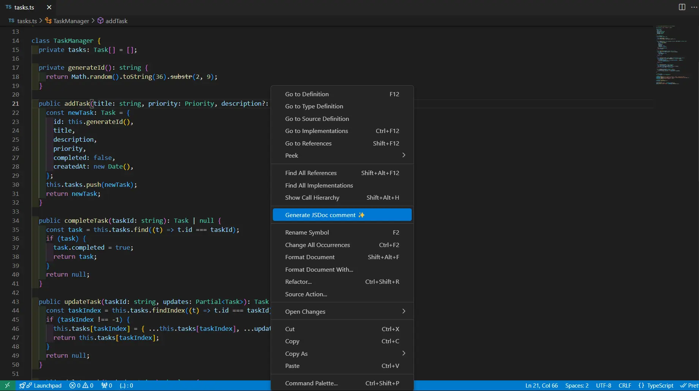
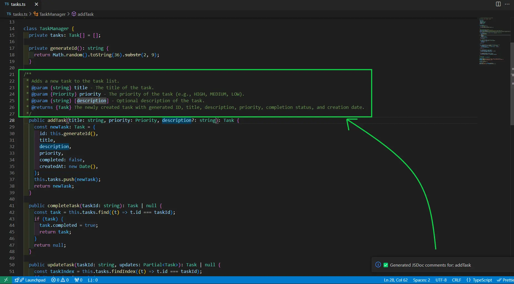

# Komento (コメント) ✨

**Komento** is a Visual Studio Code extension that helps you generate **contextual & meaningful** JSDoc comments for your functions with just a click! Simplify documentation and keep your codebase well-documented with ease.

---

## Video Preview

---

## Features 🚀

- **Context Menu Command**: The Generate command is available in context menu when you Right-click on a function declaration or inside the function.
- **Automatic Detection**: Supports various function types like function declarations, arrow functions, method declarations, and more.
- **Clean and Accurate Comments**: Generate parameter and return type annotations based on your function's signature.

---

## How It Works 🤔

1. Place your cursor inside or near a function declaration.
2. Right-click and select `Generate JSDoc Comment ✨` from the **context menu**. Alternatively you can also find this command in **command palette** `Cmd + Shift + P` / `Ctrl + Shift + P`.
3. Watch as a neatly formatted JSDoc comment appears right above your function.

---

## Screenshots 📸

### 1. Context Menu Command

_A screenshot of the user right-clicking near a function declaration and seeing the `Generate JSDoc Comment ✨` option._

### 2. Status Notification

_A screenshot of the bottom-right notification showing the current status._

### 3. Generated JSDoc Comment

_A screenshot of a generated JSDoc comment added above the function._

---

## Installation 🛠️

1. Open the Extensions view in VSCode (`Ctrl+Shift+X` or `Cmd+Shift+X` on Mac).
2. Search for `Komento`.
3. Click `Install`.
4. Enjoy seamless documentation generation!

---

## Usage 💡

1. Open any JavaScript or TypeScript file.
2. Place your cursor inside or near the function you want to document.
3. Right-click and select `Generate JSDoc Comment ✨`.
4. Customize the generated comments if needed.

---

## Limitations ⚠️

- Currently supports **JavaScript** and **TypeScript** files only.
- Works best with properly formatted and valid code.

---

## Attribution 🌟

The **Komento** logo is adapted from an icon by [Lorc](https://lorcblog.blogspot.com/) under [CC BY 3.0](http://creativecommons.org/licenses/by/3.0/). Huge thanks to them for providing free resources to the community!

---

## Feedback & Contributions 💬

We’d love to hear your thoughts, feature requests, or bug reports! Open an issue or start a discussion on [GitHub](https://github.com/akshay-rajput/komento).

Contributions are welcome! Feel free to fork the repository and submit a pull request.

---

## License 📜

This extension is licensed under the MIT License.

---

Happy documenting! 🎉
